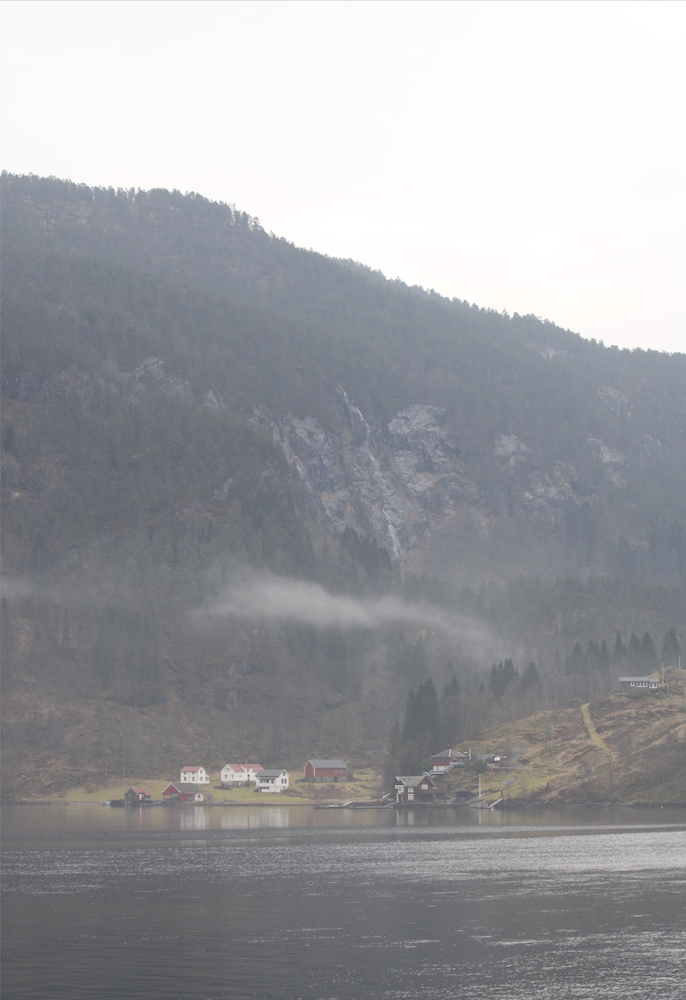
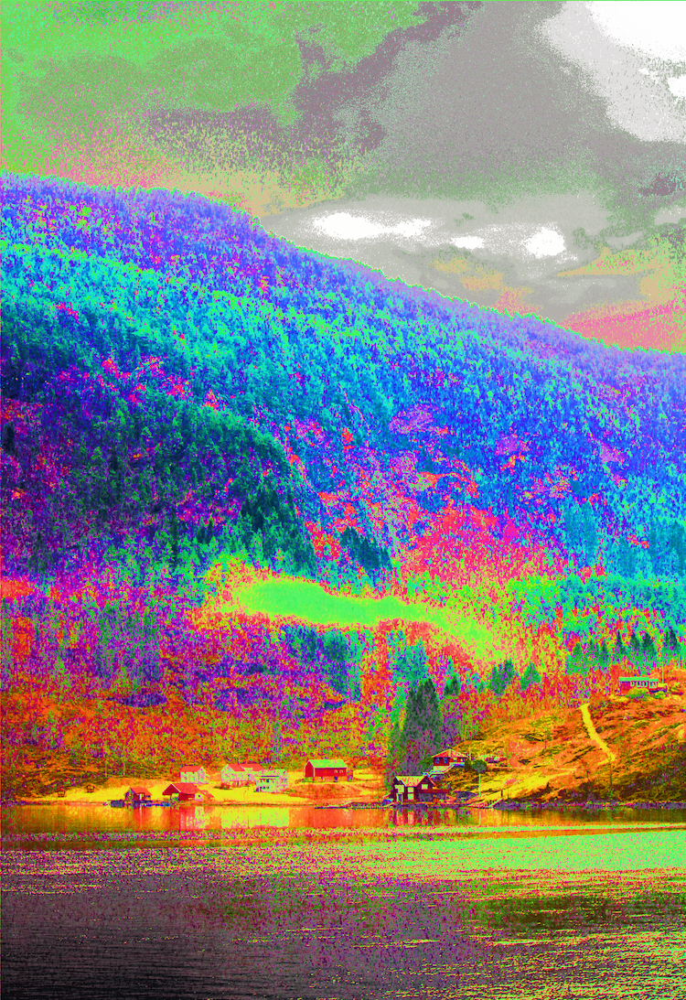
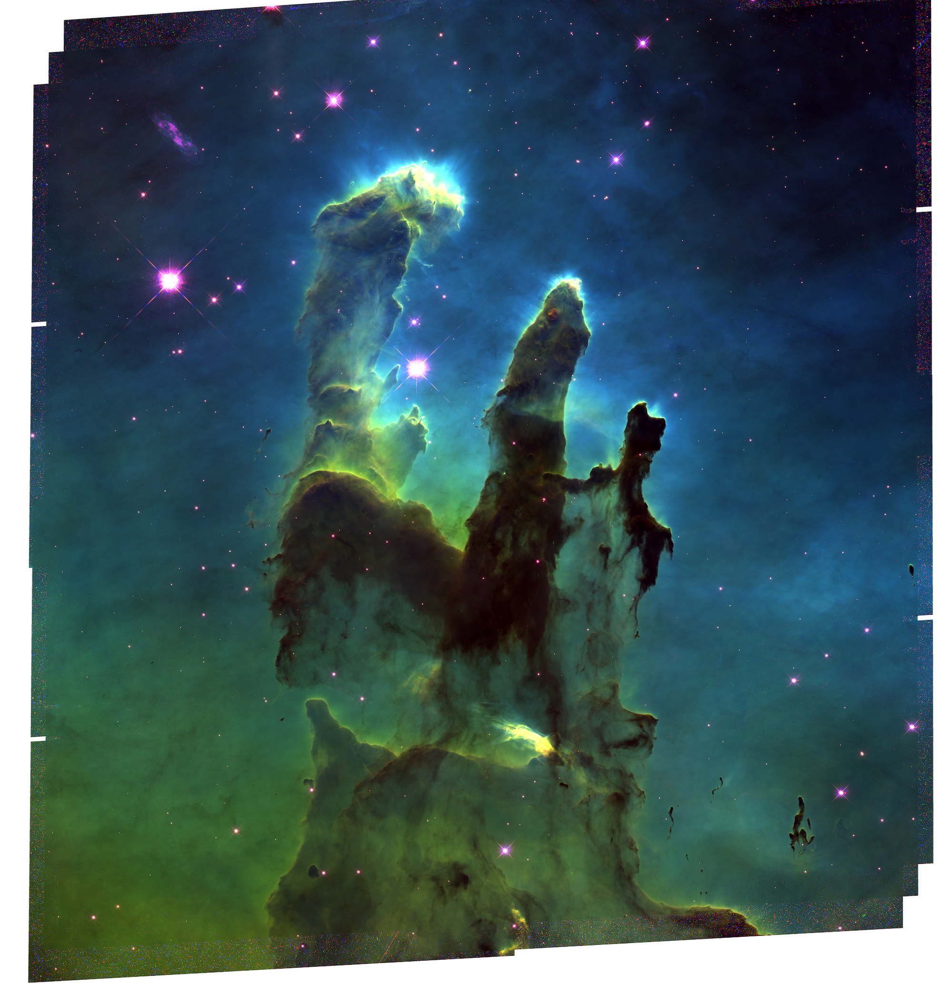
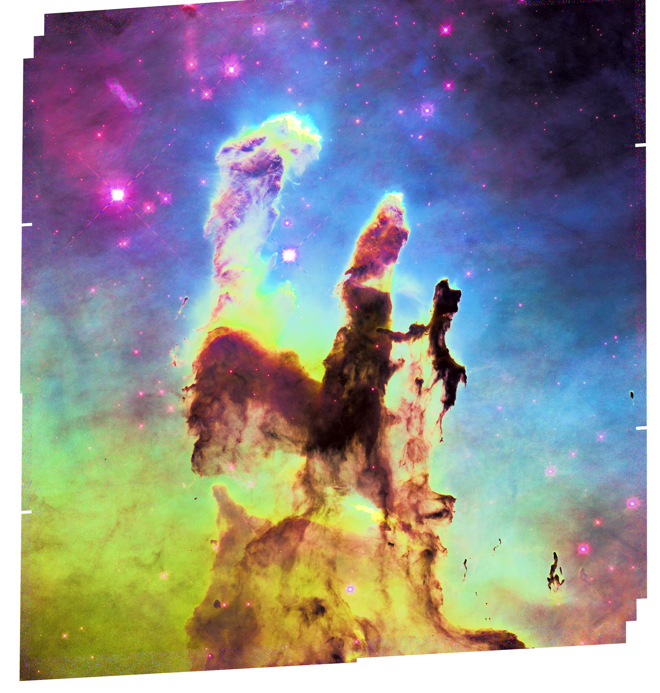

# Contrast Enhancer
Program that globally enhances contrast in images using decluttering. Written in C++ and GLSL using the Vulkan API.


| <br>Fjord Image, Bergen, Norway 2025 | <br> After 59 iterations |
|-|-|
| <br>Pillars of Creation, Hubble Legacy Archive | <br> After 10 iterations |


## Prerequisites
- C++11 or later
- Vulkan SDK (latest version recommended)
- CMake (3.10+)
- GPU with Vulkan 1.2+ support
- shader compiler:
    - glslang on mac
    - glslc on windows
- cfitsio (for macos only)

## Building

#### Windows
On Windows, the first step is to replace {VCPKG_ROOT} in the CMakePresets.json file with the root path of vcpkg. After that, execute the following commands to run the program.

(Note that it is important to be in the /bin/ directory when running the executable due to relative paths used)
```
cmake --preset windows
cmake --build .\build\
cd bin
.\vulkan_compute_boilerplate.exe exampleImage.png
```

the exampleImage.png file must be in the /images/ directory.

#### MacOS
To run the program, run the following commands from the project root.

(Note that it is important to be in the /bin/ directory when running the executable due to relative paths used)
```
cmake --preset mac
cmake --build build
cd bin
./vulkan_compute_boilerplate exampleImage.png
```

the exampleImage.png file must be in the /images/ directory.

## Program control
Program constants like the histogram resolution or the iteration count can be set in the `config.yaml` file. 

The default mode of the program supports the contrast enhancement in standard image files like .png or .jpg etc. Other modes like using multispectral images or reading the data out of csv files can be activated by setting the defined constants in the `src/main.cpp` file.

### `AUTO_STOP`
Set this to `true` to activate the automatic termination of the program when the variance over the histogram increases.

### `JITTER`
Set this to `true` to activate the addition of small random noise to improve the regularization.

### `MULTISPECTRAL_IMAGES` (only supported for macos for now)
If this is set to `true`, the user has to manually set the paths of the three spectral images (see lines 190 ff.). The program currently only supports FITS files in this simpler mode. The three paths will then be used as Red, Green and Blue channels after a light stretch which can be changed in the code if wanted.

### `DATA_ANALYSIS`
Set this to `true` to append gradient and mse values of the current histogram and image into .csv files. The data can be  accumulated over multiple runs.

### `CSV_INPUT`
Set this to true, to read the data out of csv files. The format has to be of the csv file needs to be `x,y,z,label`. The stride of the bytes for saving the data into an output image needs to be set in the `src/input.h` file (default ist 2048).

Set the `LABEL_COUNT` constant to the number of different labels in the csv file. The label should not be 0, since 0-labeled data will be ignored.

Setting the `CSV_INPUT` variable to `true` will automatically generate a .csv output file with the  `x,y,z,label` header in addition to the output image.

## Program output
The program will always generate a png outputImage, and three histogram accumulation images for the R, G and B channels.
If the user sets the `SAVECSV` constant to `true`, multiple csv files will be written into the /plot/ directory, which can be visualized with the Python scripts inside of it. Its important to note, that for histogram resolutions larger than 128, the creation of csv files can take a very long time.

## Debugging images
The program can generate a `randomImage.png`, `uniform.png` and `lineTest.png` image by setting the `RANDIMG`, `UNIFORMIMG` and `LINEIMG` to true.

### Vulkan
Different devices might need different extensions. Make sure the validation layer is (de)activated, so missing extensions are shown and can be added in the `src/main.cpp` file.
The validation layer can be activated by setting the DEBUGGING variable in the `src/vulkan_base/vulkan_device.cpp`

### LICENSE
MIT